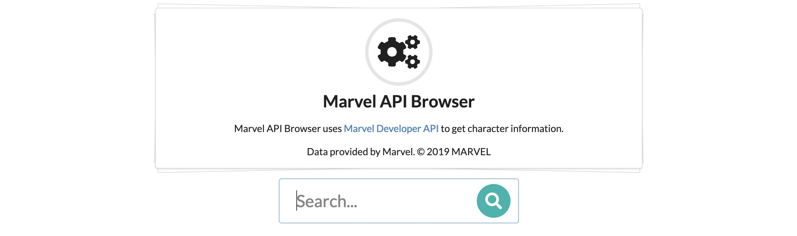

# Marvel API Browser
**Marvel API Browser** uses [Marvel Developer API](https://developer.marvel.com/) to get character information.




## Built With
- Node.js
- Semantic UI
- Express
- EJS

## Installation
```
$ git clone https://github.com/alieksi/marvel-api-browser.git
$ cd marvel-api-browser
$ npm install
```

After `npm install`, enter your Marvel Comics API public and private keys to `app.js` file.
```javascript
const marvelAPI = new MarvelAPI('PUBLIC KEY', 'PRIVATE KEY');
```

To run project:
```
$ npm start
```

## To Do
- [x] Getting character information from [Marvel Developer API](https://developer.marvel.com/).
    - [x] Connected to Marvel API and got character information.
    - [x] Controller is added for handling API response.
    - [x] Created API Router for character requests.
- [x] Show character information on UI.
    - [x] UI events are added to get information based on user input.
    - [x] Add loader to block UI when getting information from API.
    - [x] Control user input and give proper error message on modal.
    - [x] Show all character list on UI.
- [ ]  ~~Filtering character information according to specific properties.~~
- [x] Add click event to search result for showing detailed information about character.
- [x] Add key('Enter') event to search character.
- [x] Create pagination for search results.

# Attribution
**Data provided by Marvel. © 2019 MARVEL**